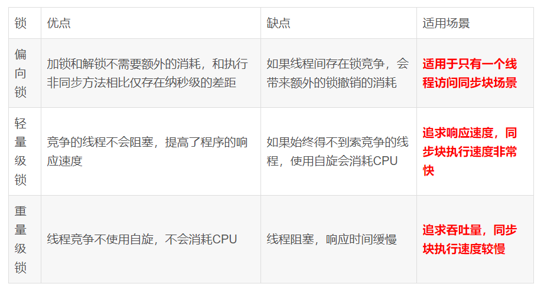
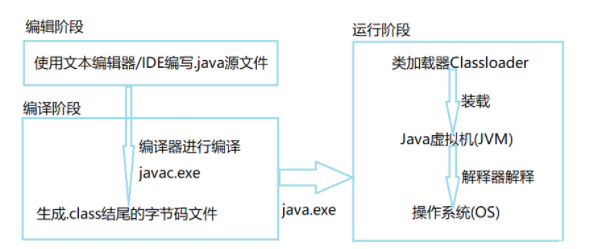
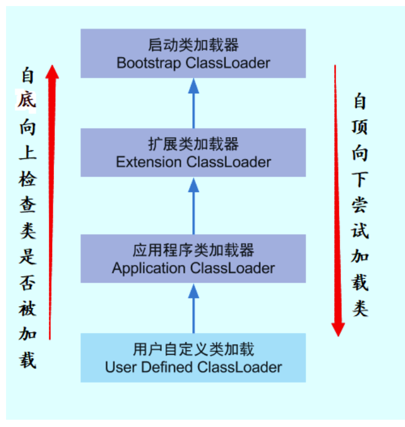
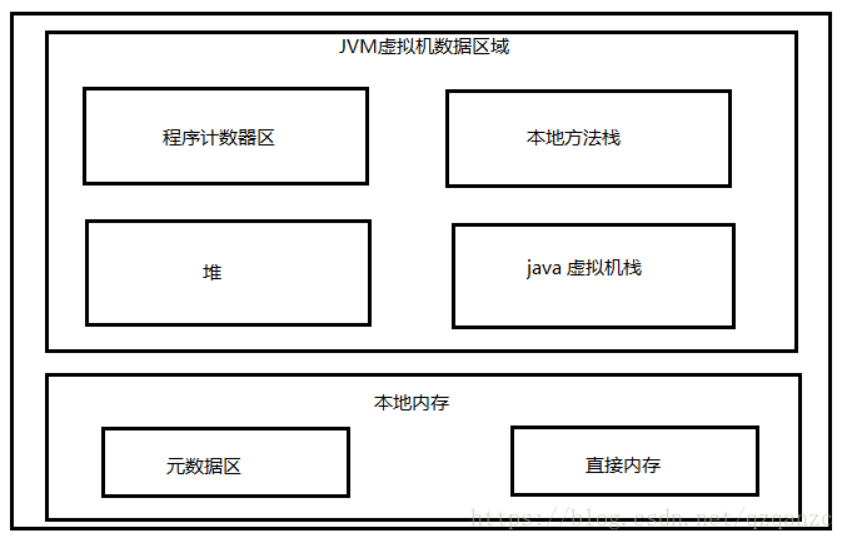
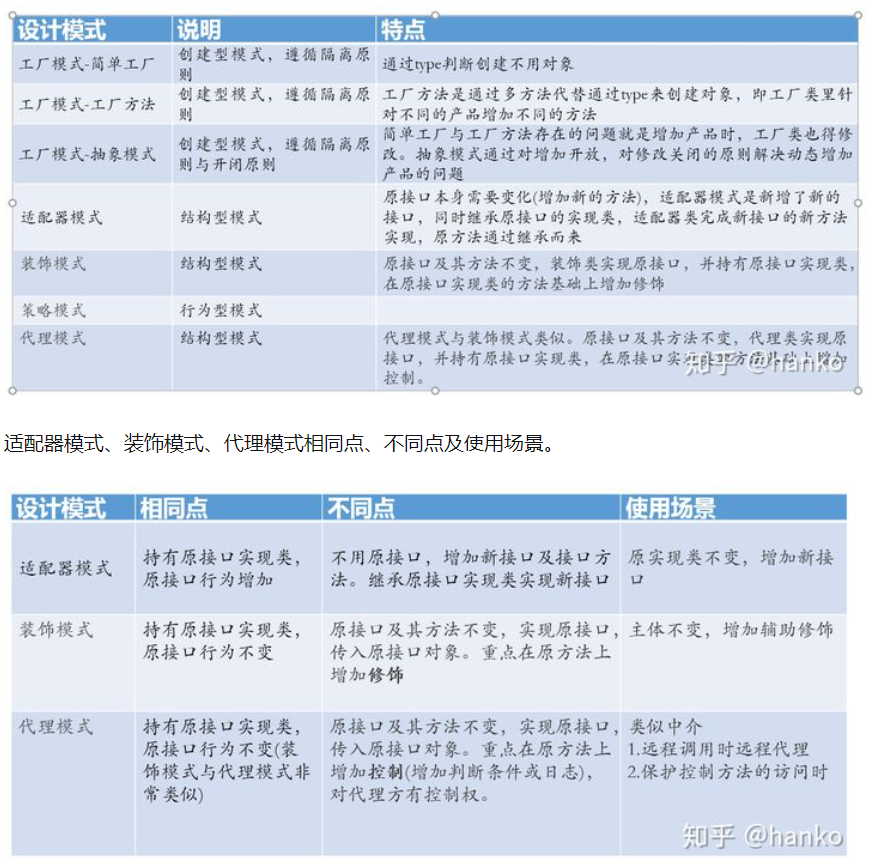
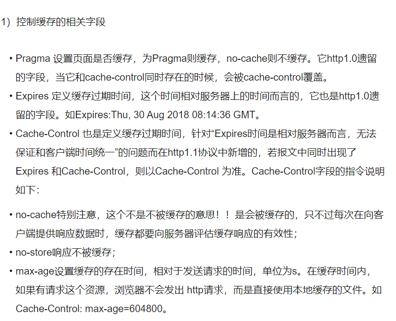
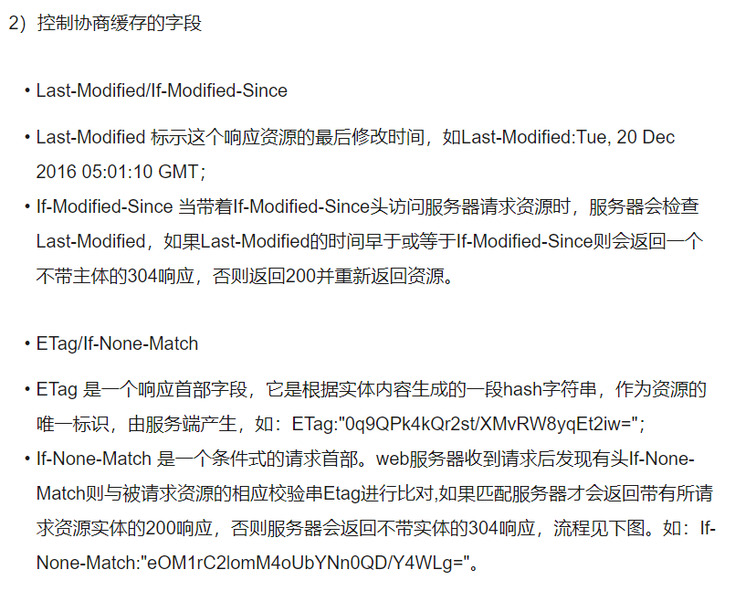
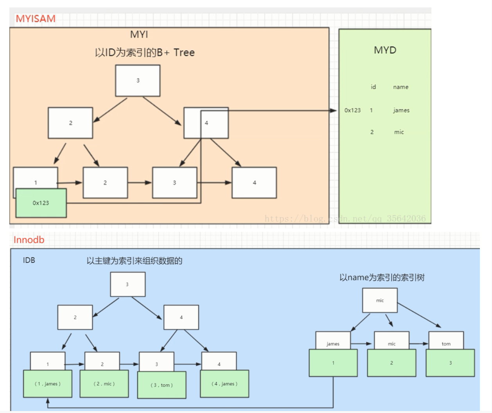
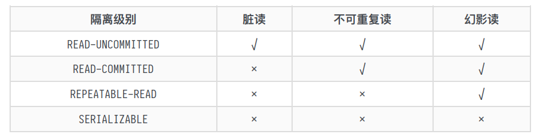

## Java

### java语言特性

####  Q1.String StringBuffer StringBuilder区别与关联

StringBuffer 、StringBuilder继承了接口AbstractStringBuilder，而AbstractStringBuilder继承了charSequence和Appendable接口，与此同时String仅继承了charSequence接口。

- String线程安全，`对象不可变`，适用于操作少量的数据
- StringBuilder`非`线程安全，无同步锁，对象可变，单线程操作字符串缓冲区，可操作大量数据
- StringBuffer 线程安全，对方法`加了同步锁`，对象可变，`多线程操作`字符串缓冲区，可操作大量数据

String值不可变，导致每次对String的操作都会生成新的String对象，不仅效率低下，而且浪费了大量内存空间。

StringBuffer是可变类，任何对他的指向的字符串操作都不会产生新的对象，每个StringBuffer对象都有一定的缓存区容量，当字符串大小都没超过容量，并不会分配新的内容，当字符串大小超过容量会自动增加容量。

#### Q2. java复制算法

分为直接复制，浅复制和深复制

- 直接复制： A a1=a2,实际上是复制引用，a1，a2指向同一对象
- 浅复制：复制值（值类型）/引用（引用类型），不复制对象
- 深复制：不仅复制对象本身且复制引用指向的所有对象，要深复制一个对象，常常先使其实现Serializable接口

#### Q3. 异常处理

- Error是java运行内部异常，表示内部错误或资源耗尽错误，会使得程序尽力安全终止
- Exception可分为运行时异常和检测异常RuntimeException、CheckedException，检测异常发生在编译阶段。
  Error和Exception都继承了Throwable接口
- Throw用于函数内部，+异常对象，表示一定抛出某种对象
- Throws用于函数上，+异常类，表示可能性

#### Q4.B树和B+树

- B树是一种多路搜索树，非叶子节点最多M个儿子，且M>2，根节点儿子数为[2,M]，除了根节点所有的非叶子的儿子数为[M/2-1,M]，每个节点关键字数为[M/2-1,M-1]，至少两个。（可为空）
  搜索过程：从根节点开始，对内部关键字进行二分查找，儿子指针或者已经是根节点的时候就结束了
- B+树，通常是用于数据库和操作系统的文件系统中，是B树的变形。B+树非叶子结点指针和关键字数目相同。
  B+树为所有叶子节点增加了一个链指针，所有的关键字均在叶子节点上出现。并且是有序的。
  搜索过程：B+树只有到达了根节点才算命中，B树可能在非叶子节点就命中了。
- 优缺点对比：
  - B树在文件系统中应用，用于文件的索引
  - B+树方便扫库，B树必须是中序遍历的。B+树可直接从叶子节点挨个扫
  - B+树支持区间查找，B树不支持
  - B树所需要查找的值恰好在一个非叶子节点，则查找到该节点则查询结束
  - B+树种，无论查询是否成功，都走了一条从根到叶子节点的路径

#### Q5.对象序列化

序列化（Serialization）是java语言内建的一种对象持久化机制，是将对象的状态信息转化为可存储或者传输的形式的过程（字节流）。如果不想进行序列化，可以使用transient关键字，只修饰变量，不修饰类和方法

序列化方法：实现Serializable接口

#### Q6. 反射是什么

概念：在运行状态中，对任意一个类都能知道这个类的所有属性和方法，对任意一个对象都能调用它的任意方法和属性。提高了Java程序的灵活性和扩展性。降低了耦合性，提高自适应能力。允许程序创建和控制任何类的对象，无需提前硬编码目标类。但是存在性能问题和代码维护问题。

基本步骤：1.导入java.lang.reflect	2.获取需要操作的类的Java.lang.Class对象  3.调用Class方法获取 4. 使用反射API进行操作（设置属性，调用方法）

在Spring里面有广泛应用

#### Q7. hash冲突产生的原因，4种对应的解决方案

哈希表也叫散列表，许多缓存技术的核心就是内存中维护了一张大的哈希表。如果不同元素通过哈希函数得出的实际存储地址相同就是产生了**哈希冲突**也叫哈希碰撞，哈希冲突解决的办法有：开放地址法（发生冲突，则继续寻找下一块未被占用的存储地址）、再哈希、链地址法、建立公共溢出区。

#### Q8. static关键字

static是一个修饰符，用于修饰**成员方法、类的成员变量**，另外static代码块可以用来优化程序性能，被static修饰的方法或变量不需要依赖对象来进行访问，只需要类被加载就可以通过类名进行访问。

误区：1 与C/C++的static不同，java的static关键字不会影响到变量或方法的作用域。在java中影响访问权限的只有private、public、protected这几个关键字。2 虽然对于静态方法来说没有this，但是我们在非静态方法中能够通过this访问静态方法成员变量。

#### Q9.hashCode与equals、==与equals的区别  

**hashcode与equals**

1. 如果两个对象相等，则hashcode一定也相同
2. 两个对象相等，equals方法返回true
3. 两个对象有相同的hashcode值，他们也不一定是相等的
4. 如果equals方法被覆盖过，则hashcode方法也必须被覆盖
5. hashCode默认行为是对堆上的对象`产生独特值`，如果没有重写hashCode，则该class的两个对象无论如何都不会相等。（即使这两个对象指向相同的数据）

**==和equals区别**

1. **==**是判断两个变量或实例是否**指向同一内存空间**，**equals**是判断两个变量或实例所指向的**内存空间值是否相同**
2. ==是指对**内存地址**进行比较，equals是对**字符串内容**进行比较
3. ==指**引用是否相同**，equals指的是**值是否相同**

#### Q10. 运行时异常和非运行时异常

Throwable有两个重要的子类：exception和error，两者都是java异常处理的重要子类，都包含了大量子类。

- Error是程序无法处理的错误，表示运行应用程序中较严重的问题，大多数错误与代码编写者执行的操作无关，而表示代码运行时JVM虚拟机出现问题。
  - 例如，java虚拟机运行错误（Virtual MachineError），当jvm不再有继续执行操作所需要的内存资源时，将出出现OutOfMemoryError ，这些异常发生时，JVM虚拟机一般选择线程终止
- Exception是程序本身可以处理的异常，分为checked exceptions和unchecked exceptions :
  - unchecked exceptions都是RuntimeException类及其子类异常
  - checked exceptions非运行时异常，是RuntimeException以为的异常，类型上都属于Exception类及其子类。
  - 异常表示java程序运行过程中可能出现的非正常状态，**运行时异常**表示虚拟机的**通常操作中可能遇到的异常**，是一种常见运行错误。java编译器要求方法必须声明抛出可能发生的**非运行时异常**，但是**并不要求声明抛出未被捕获的运行时异常**。

#### Q11. 接口和抽象类

1. 所有方法在接口中不能有实现，而抽象类可以有非抽象的方法。
2. 接口中除了static、final变量，不能有其他变量，而抽象类中则不一定
3. 一个类可以实现多个接口，但是只能实现一个抽象类，接口自己本身可以通过extends关键字扩展多个接口
4. 接口的方法默认是public，抽象方法可以有public、protected、default这些修饰符
5. 从设计层面看，**抽象是对类的抽象，是一种设计模板**，而**接口是对行为的抽象，是一种行为规范**

### 集合

#### Q1.ArrayList扩容机制

int newlength= length+lenth>>1

1. Arraylist创建对象时，若未指定集合大小初始化为0，若指定了大小，集合大小则为指定大小
2. 当第一次调用add方法时，集合长度变为10和addAll之间的较大值
3. 之后再调用add方法，先将集合扩大1.5倍，如果仍然不够，新长度会传入集合大小。

#### Q2.HashMap实现、初始化、扩容机制

JDK1.8之前，HashMap底层是**数组+链表**结合在一起使用，即链表散列。所谓拉链法，就是将链表与数组相结合，即创建一个链表数组，数组中每一格就是一个链表，若遇到哈希冲突，则将冲突值加到链表中即可。

JDK1.8之后，在解决哈希冲突时有了较大的变化，当链表长度大于阈值（默认为8）时，将链表转化为红黑树，以减少搜索时间。红黑树转链表退化是6。**这个和hashcode碰撞次数的泊松分布有关，主要是为了寻找一种时间和空间的平衡。**红黑树高度上限为log2(n+1)

HashMap的长度一直是2的幂次方这个与数组的下标计算方法有关。

HashMap的初始容量默认大小为16，当容量超过阈值16*0.75=12，则会触发扩容。一开始默认内部数组为null，即没有实例化，在第一次put后就会触发第一次初始化扩容，长度为16。如果不是第一次扩容，则容量变为原来的两倍，阈值也变为原来的2倍。

#### Q3.hashMap为什么不能并发控制

在并发下Rehash会造成元素之间形成一个循环链表。不过JDK1.8后解决了这个问题，但晒晒不建议在多线程下使用HashMap，因为多线程下使用HashMap海水存在数据丢失的问题，并发环境下推荐使用ConcurrentHashMap。

#### Q4.红黑树的特点

1. 每个节点是黑色或者是红色
2. 根节点是黑色
3. 每个叶子节点(NIL)是黑色，这里的叶子节点是指为空(NIL或NULL)的叶子节点
4. 如果一个节点是红色，则它的子节点必须是黑色
5. 从一个节点到该节点的子孙节点的所有路径上包含相同数目的黑节点

#### Q5. hashMap、ConcurrentHashMap、hashtable、hashset

**hashMap对比hashtable**

- 是否线程安全：HashMap是非线程安全的，HashTable是线程安全的，HashTable内部方法基本都经过synchronized修饰
- 效率：因为线程安全问题，hashMap要比HashTable效率高一点。另外HashTable基本被淘汰，在代码中尽量不使用
- 对Null key和Null Value支持：HashMap的null可以作为键，这样的键只有一个，可以有多个或一个键对应的值为Null。但是HashTable中put进键值的只要有一个是null，就会抛出空指针异常NullPointerException 
- 初始容量大小和每次扩充容量大小的不同：
  1. 创建时如果不指定容量初始值，Hashtable默认的初始化大小为11，之后每次扩充，变为原来的2n+1。HashMap默认初始化大小为16，之后每次扩充，容量变为原来的2倍。
  2. 创建时如果给定容量初始值，那么Hashtable会直接使用给定的大小，而HasMap会将其扩充为2的幂次方大小。
- 底层数据结构：JDK1.8以后HashMap在解决哈希冲突时有了较大的变化，当链表长度大于阈值（默认为8）时，会将链表转化为红黑树，以减少搜索时间，而Hashtable没有这样的机制。

**hashMap对比hashset**

- hashSet底层是基于hashMap实现的，除了clone、writeObject、readObject等自主实现，其他均直接调用hashMap中的方法
- hashMap实现map接口，hashset实现set接口
- hashMap存储键值对，hashset仅存储对象
- hashMap使用put方法向map添加元素，hashset使用add方法向set添加元素
- hashMap使用键计算hashcode，hashset使用成员对象计算hashcode，对于两个对象hashcode可能相同，使用equals方法来判断对象是否相等。

ConcurrentHashMap底层实现:

### 并发与多线程

#### Q1 锁的优化：分离、粗化、消除

**锁分离：**读写锁思想的延伸就是锁分离，最常见的读写锁就是ReadWriteLock，根据功能进行分离成读锁和写锁，这样读读不互斥，读写互斥，写写互斥，保证了线程安全，提升了性能。读写分离思想可以延伸，只要操作互不影响，锁就可以分离，比如LinkedBlockingQueue 从头部取出，从尾部放数据。

**锁粗化：** 通常情况下，为了保证多线程间的有效并发，会要求每个线程持有锁的时间尽可能短，但是某些情况下，一个程序对同一个锁不间断、高频地请求、同步与释放，会消耗掉一定地系统资源，因为锁的请求、同步与释放本身会带来性能损失**，这样高频的锁请求就反而不利于系统性能的优化**，虽然单次同步操作的时间可能很短。锁粗化就是告诉我们任何事情都要有个度，有些情况下我们**反而希望把很多次锁的请求合并成一个请求**，以降低短时间内大量锁请求、同步、释放带来的性能损耗。

**锁消除：**锁消除是在编译器级别的事情，在即使编译器时，如果发现不可能被共享的对象，则会消除这个对象的锁操作，多数是因为程序员编码不规范。

#### Q2 锁的四种状态 无锁状态、偏向锁、轻量级锁、重量级锁

**偏向锁**：

在大多数情况下锁是不仅不存在多线程竞争，而且总数由同一线程多次获取。**偏向锁的目的是在某个线程获得锁后，消除这个线程重入（CAS）的开销，看起来让这个线程得到了偏护**。在该某个线程第一次成功锁时,会在对象头和线程的栈帧中的锁记录中存储所偏向的线程id,如果下一次还是该线程获取锁,则不需要进行cas操作来加锁和解锁,大大减少了性能的消耗。偏向锁只能在有且只有一个线程获取锁时生效,如果有第二个线程想要获取锁,那么偏向锁就会膨胀为轻量级锁。

**轻量级锁**：锁可以从偏向锁升级到轻量锁，再升级到重量级锁，但是锁的升级是单向的，也就是说不可能出现锁的降级。轻量级是相对于**使用操作系统互斥量**来实现的传统锁而言。但是，首先需要强调一点轻量级锁并不是用来代替重量级锁的，它的本意是在没有多线程竞争的前提下，减少传统的重量级锁使用产生的性能消耗。轻量级锁适用的场景是**线程交替执行同步块的情况**，如果存在同一时间访问同一锁的情况，就会导致轻量级锁膨胀为重量级锁。

**重量级锁：**Mutex Lock，Synchronized是通过对象内部一个叫监视器锁（monitor）来实现的。监视器的本质是依赖底层操作系统的Mutex Lock来实现的。而操作系统实现线程之间切换就需要从用户态转换到核心态，这个成本非常高，状态之间的切换需要相对较长时间，这就是为什么Synchronized效率低的原因。因此这种依赖于操作系统Mutex Lock所实现的锁我们称为重量级锁。

#### Q3 ReentrantLock Semaphore 与 synchronized  volatile区别

**Semaphore** ：是一种基于计数的信号量，它可以设置一个阈值，基于此，多个线程竞争获取许可信号，做完后自己的申请将会归还，当超过阈值后，线程申请许可信号将会被阻塞。支持多个线程同时访问某个资源，可以用来构建一些对象池、资源池例如数据库连接池。

**volatile与synchronized  ：**

volatile保证了:**变量的可见性、禁止重排序**。在访问volatile变量时不会执行加锁操作，因此也就不会使得线程发生阻塞。

1. volatile关键字是线程同步的轻量级实现，所以volidate性能比synchronized 关键字要好。但是synchronized可以用来修饰**方法以及代码块**然而volidate关键字只能用于修饰变量。1.6版本后为了减少获得锁和释放锁带来的性能损耗引入了偏向锁和轻量级锁，以及各种优化提升了性能，实际开发中还是synchronized 关键字使用场景多一些
2. 多线程访问volatile关键字不会发生阻塞，但是synchronized 关键字可能会发生阻塞
3. volatile关键字保证了**数据的可见性**，但是**不能保证数据的原子性**。synchronized  两者都能保证
4. volatile关键字主要用于**解决变量在多个线程之间的可见性**，而synchronized  关键字解决的是**多个线程之间访问资源的同步性**。

synchronized 和ReentrantLock ：

​		同：都是用来**协调多线程对共享对象、变量的访问**。都是**可重入锁**，同一线程可以多次获得同一个锁。都保证了**可见性和互斥性**。

​		不同：

1. ReentrantLock 是API级别，synchronized  是JVM级别。synchronized  底层实现是同步阻塞的，使用悲观并发策略，ReentrantLock 是同步非阻塞，使用乐观并发策略。
2. synchronized  在发生异常时，会自动释放线程占有的锁，因此不会导致死锁现象的发生，而Lock在发生异常时候，如果没主动通过unLock()去释放锁，很有可能造成死锁现象，因此使用Lock时候需要在finally块中释放锁。
3. Lock可以让等待锁的线程响应中断，而synchronized  则会让等待线程继续等待，不会响应中断。

#### Q4 聊一聊Java锁  乐观/悲观 公平/非公平 共享/独占  自旋锁 同步锁/死锁 

**乐观/悲观**：

- 乐观锁是一种乐观思想，即认为读多写少，遇到并发写的可能性低，每次去拿数据的时候都认为别人不会修改，所以不会上锁。乐观锁基本都是通过CAS操作实现的，CAS是一种更新的原子操作，比较当前值和传入值是否一样，一样则更新，如果失败则重复CAS操作。
- 悲观锁是一种悲观思想，即认为写多，遇到并发的写的可能性高，每次拿数据都认为别人会修改，所以在每次读写数据的时候都会上锁。java中典型的悲观锁就是synchronized

**公平/非公平：**

- 公平：加锁前检查是否有排队等待的线程，优先排队等待的线程，先来先得
- 非公平：加锁时不考虑排队等待问题，直接尝试获取锁，获取不到就自动到队尾等待。
  - 非公平锁性能比公平锁高5~10倍，因为公平锁需要在多核情况下维护一个队列
  - java的synchronized是非公平锁，ReentrantLock默认的lock方法也是非公平锁

**共享和独占:**

- 独占模式下，每次只能有一个线程持有锁，ReentrantLock就是以独占方式实现的互斥锁。独占是一种悲观保守的加锁策略，它避免了读读冲突，如果某个只读线程获取锁，则其他读线程都只能等待，这种情况下限制了不必要的并发性，因为读操作并不会影响数据的一致性。
- 共享锁允许多个线程同时获取锁，并发访问共享资源，如ReadWriteLock。共享锁则是一种乐观锁，它放宽了加速策略，允许多个执行操作的线程同时访问共享资源。
  - java的并发包中提供了ReadWriteLock读写锁，它允许一个资源可以倍多个读操作访问，或者被一个写操作访问，但是两者不能同时进行

**自旋锁：**

- 如果持有锁的线程能在很短时间内释放锁资源，那么等待竞争锁的线程就不需要做内核态和用户态之间的切换进入阻塞挂起状态。它们只需要等一等（自旋），等待有锁的线程释放锁后即可立即获取锁，这样就避免了用户线程和内核线程切换的消耗。
- 优点：减少线程的阻塞，对于锁的竞争不激烈且占用锁时间非常短的代码块来说性能能大幅度提升。

**同步锁/死锁 ：**

- 同步锁：当多个线程同时访问同一个数据时，很容易出问题，为了避免这种情况出现，我们要保证线程同步互斥，即并发执行多个线程，在同一时间内只允许一个线程访问共享数据。java中可以使用synchronized关键字来获取一个对象的同步锁。
- 死锁：死锁就是指多个线程被同时阻塞，他们中的一个或者全部都在等待某个资源被释放。

#### Q5 多线程如何保证不死锁，死锁产生的条件以及避免方法

线程死锁：多个线程被同时阻塞，他们中的一个或者全部都在等待某个资源被释放。由于线程被无限期阻塞，因此程序不可能正常终止。死锁的产生需要具备以下的条件：

1. 互斥条件：该资源一个时刻只能被一个线程占用
2. 请求与保持条件：一个进程因请求资源而阻塞时，对已经获得的资源保持不放
3. 不剥夺条件：线程已获得的资源在未使用完前不能被其他线程强行剥夺，只有自己使用完毕后才释放资源。
4. 循环等待条件：若干进程之间形成一种头尾相接的循环等待资源关系。

死锁的避免方法：只需要破坏产生死锁的四个条件中的一个就行。

1. 破坏互斥条件：这个条件无法破坏，因为我们用锁的本来目的就是为了让他们互斥（临界资源需要互斥访问）
2. 破坏请求与保持：一次性申请所有的资源
3. 破坏不剥夺条件：占用部分资源的线程进一步申请其他资源时，如果申请不到，可以主动释放它占用的资源
4. 破坏循环等待条件：靠按序申请资源来预防，按照某一顺序申请资源，释放资源则反序释放。

#### Q6 什么是守护进程

守护进程是运行在后台的一种特殊进程，它独立于控制终端并且周期性地执行某种任务或等待处理某些发生地时间。也就是说守护进程不依赖于终端，但是依赖于系统。当JVM中所有的线程都是守护线程的时候，JVM就退出了，但是如果还有一个或以上的非守护线程，则JVM不会退出。

#### Q7.怎么定位死锁

定位死锁最常见的方法就是利用jstack等工具获取线程栈，然后定位互相之间的依赖关系，进而找到死锁，如果比较明显的死锁，jstack可以直接定位，

### JVM虚拟机

#### Q1.4种垃圾回收算法

- **标记-清除算法**：先标记所需要回收的对象，在标记完成后统一回收所有被标记的对象。
  - 效率问题
  - 空间问题–标记清楚后会产生大量不连续的碎片
- **复制算法**：可以将内存分为大小相同的两块，每次使用其中的一块，当内存用完后，将还存活的对象复制到另一块，然后再把使用的空间一次清理掉。
- **标记-整理算法**：标记过程和标记清除算法一样，但是后续步骤不是直接对可回收对象回收，而是让所有存活的对象向一端移动，然后直接清理掉边界以外的内存。
- **分代收集算法**：根据对象存活的周期不同将内存分为几块，（当前算法都是基于分代收集算法，根据各个年代不同的特点选择合适的垃圾收集算法）
- 例如：
  - **新生代**中，每次收集都会有大量对象死亡，可以选择**复制算法**，只要付出少量对象的复制成本，就可以完成每次垃圾收集。**老年代**的对象存活几率比较高，而且没有额外的空间对它进行分配担保，所以我们必须选择**“标记-清除”或“标记-整理”**算法进行垃圾收集

#### Q2.1 一个java文件从加载到执行经历了什么

java程序从编写到最终运行大概可以包括3个阶段：编写、编译、运行。

1. 编写java应用程序过程中，需要符合java语法规范的前提下编辑java源代码
2. 将源代码编译成.class文件，如果java源代码在编译过程中没有出现语法错误，将会编译生成class文件，编译阶段的实质就是检测语法错误
3. 运行阶段，JVM会将字节码文件装载进去，然后JVM对字节码文件进行解释，其中解释器会将字节码文件解释称一系列的二进制码，JVM将二进制码交给操作系统，操作系统进行二进制码的执行。整个运行阶段就是JRE在起作用。

#### Q2.2一个java对象的创建过程

1. **类加载检测**：虚拟机遇到一条new指令，首先检测这个指令的参数是否能在常量池中定位到这个类的符号引用，并检查这个符号引用代表的类是否已被加载过、解析和初始化过。如果没有，则必须执行相应的类加载过程。
2. **分配内存**：在类加载检查通过后，接下来虚拟机会为新生对象分配内存。对象所需要的内存大小在类加载完成后便可确定，为对象分配空间的任务等同于把一块确定大小的内存从Java堆中划分出来。分配方式有“指针碰撞”和“空闲散列”两种，具体分配方式由Java堆是否规整来决定，而是否规整又取决于所采用的垃圾收集器是否带有压缩整理功能。
3. **初始化零值**：初始化0值这一步确保了对象的实例字段在Java代码中可用不赋初始值就能直接使用。
4. **设置对象头**：虚拟机堆对象进行必要的设置，例如对象的实例、如何找到类的元数据信息、对象的哈希码、对象的GC年代等，这些信息都存放在对象头中。
5. **执行init方法**：上述完成后，从虚拟机的角度看，一个新的对象已经产生了，但是从Java程序角度看，对象的创建才刚开始，\<init\>方法还没执行，所有的字段都还是零。所以一般来说，执行new指令之后会接着执行init方法，把对象按照程序员的意愿进行初始化，这样一个真正可用的对象才算完全产生处来。

#### Q2.3 类加载过程与双亲委派模型

类的加载过程：加载–》连接–》初始化，连接过程又可分为三步：验证–》准备–》解析

加载过程的第一步主要完成三件事：

1. 通过全类名获取定义此类的二进制字节
2. 将字节流所代表的静态存储结构转换为方法区的运行时数据结构
3. 在内存中生成一个代表该类的class对象，作为方法区这些数据的访问入口

一个非数组类的加载阶段是可控性最强的阶段，这一步我们可以 去完成还可以自定义加载器去控制字节流的获取方式（重写一个类加载器的loadClass()方法）。数组类型不通过类加载器去创建，它由java虚拟机直接创建。

三种类加载器ClassLoader，除了BootstrapClassLoader  其他均由java实现且全部继承自java.lang.ClassLoader

1. 启动类加载器BootstrapClassLoader  ，最顶层的加载类
2. 扩展类加载器ExtensionClassLoader  ，加载JRE——HOME下面的jar类
3. 应用程序类加载器AppClassLoader  ，面向用户的加载器，负载加载当前应用classpath下的所有jar包和类

**双亲委派模型：**

每个类都有一个对应它的类加载器，系统中classloader在协同工作的时候会**默认使用双亲委派模型**，即在类加载的时候，**系统会首先判断当前类是否被加载过**，**已经被加载的类会直接返回**，否则才会尝试加载，**加载的时候，会首先把该请求委派给该父类加载器locass()负载处理，因此所有的请求最终都应该传送到顶层的启动类加载器BootstrapClassLoader  中**。当父类加载器**无法处理**的时候，**才会来自己处理，**当父类加载器为null，会使用启动类加载器BootstrapClassLoader  作为父类加载器。

双亲委派**保证了java程序的稳定运行，可以避免类的重复加载，****JVM区分不同类的方式不仅仅是根据类名，相同的类文件被不同的类加载器加载产生的是两个不同的类**，也保证了java核心API不会被篡改，如果没有使用双亲委派，而是每个类加载器自己加载自己则会出现一些问题，⽐如我们编写⼀个称为 java.lang.Object 类的话，那么程序运⾏的时候，系统就会出现多个不同的  Object 。

除了 **BootstrapClassLoader** 其他类加载器均由 Java 实现且全部继承⾃java.lang.ClassLoader 。如果我们要⾃定义⾃⼰的类加载器，很明显需要继承 **ClassLoader** 。  

#### Q3.方法区与运行时常量池

方法区和java堆一样，是各个线程共享的内存区域，它用于存储已被虚拟机加载的类信息、常量、静态变量、即时编译后的代码等数据。虽然Java虚拟机规范把方法区描述为堆的一个逻辑部分，但是它却有一个别名叫Non-Heap，目的是为了与java堆区分开来。

方法区也称为永久代，他们的关系很像Java中的接口和类的关系，类实现了接口，而永久代就是HotSpot虚拟机对虚拟机规范中方法区的一种实现。

##### Q3.1为什么要将永久代替换为元空间？

1.6之前方法区里面包含了运行时常量池，1.8之后方法区被元空间所代替。整个永久代有一个JVM本身设置固定的大小上线，无法进行调整，而元空间使用的是直接内存，受本机可用内存的限制，并且永远不会发生OutOfMemoryError

#### Q4. 深拷贝和浅拷贝有什么区别？

在创建新实例类型时使用浅拷贝，并保留在新实例中复制的值。浅拷贝用于复制引用指针，就像复制值一样。这些引用指向原始对象，并且在类的任何成员中所做的更改也将影响它的原始副本。浅拷贝允许更快地执行程序，它取决于所使用的数据的大小。

深拷贝用于存储已复制的值。深拷贝不会将引用指针复制到对象。它引用一个对象，并存储一些其他对象指向的新对象。原始副本中所做的更改不会影响使用该对象的任何其他副本。由于为每个被调用的对象创建了某些副本，因此深拷贝会使程序的执行速度变慢。

#### Q5. Java对象创建时内存分配与JVM内存模型

Java对象创建时的内存分配方式：首先进行类加载检查，完成后会为新生的对象分配内存空间，对象所需的内存空间大小在类加载完之后随即确定。分配方式选择受堆空间是否规整影响，而堆空间是否规整取决于JVM采用的垃圾回收机制以及是否具有压缩整理功能。

1. **指针碰撞**：如果堆内存是规整空间，即已经分配的内存与未使用的内存都是连续的空间，此时存在着一个指针位于已用与可用内存的分界，新内存的分配即指针移动对象大小的距离即可。
2. **空闲散列**：如果堆空间中已经分配的内存与未分配的内存互相交错，就需要使用“空闲列表”的方式进行内存分配操作。此时堆内存中维护了一份可用内存的列表，当有新内存分配的需求时，会到空闲列表中确定足够大小的内存空间予以分配操作。

根据JVM规范，JVM内存分为**Java堆（线程共享）、方法区（线程共享）、虚拟机栈（线程私有）、本地方法栈（线程私有）、程序计数器（线程私有）**五个部分。

**Java堆：**被所有线程共享的一块内存区域，在虚拟机启动时候创建，用于存放对象实例。当堆中内衣内存可以分配给实例即再也无法扩展时，会抛出outOfMemoryError异常。

**方法区：**用于存储已经被虚拟机加载的类信息、常量、静态变量等。这个区域的内存回收目标主要是针对常量池的回收和堆类型的卸载。

**虚拟机栈：**方法在执行的时候会创建一个栈帧，存储局部变量、操作数、动态连接和方法返回地址。每个方法从调用到执行完毕，对应一个栈帧在虚拟机栈中的入栈和出栈。如果线程请求的栈深度大于虚拟机所允许的深度，则StackOverflowError，如果虚拟机栈可以动态扩展，扩展到无法申请足够的内存，则OutOfMemoryError。

**本地方法栈：**和虚拟机栈类似，主要是为虚拟机使用到的Native方法服务，也会抛出StackOverflowError。

**程序计数器：**正在执行java方法的话，计数器记录的是虚拟机字节码指令的地址（当前指令的地址），如果是native方法，则为空

#### Q6.GC收集器

Serial收集器、parNew收集器、Parallel Scavenge收集器、CMS收集器、G1收集器

- CMS收集器是一种以获取最短回收停顿时间为目标的收集器，HotSpot虚拟机第一款真正意义上的并发收集器，第一次实现让垃圾收集线程与用户线程（基本上）同时工作。运作流程分为四个步骤：
  - **初始标记**：暂停所有的其他线程，并记录下直接与root相连的对象，速度很快
  - **并发标记**：同时开启GC和用户线程，用一个闭包结构去记录可达对象。在这个阶段技术，这个闭包结构并不能保证包含当前所有的可达对象。因为用户线程可能会不断更新引用域。所以GC线程无法保证可达性分析的实时性。所以这个算法会跟踪这些记录发生引用更新的地方。
  - **重新标记**：重新标记阶段就是为了修正并发标记期间因为用户程序继续允许而导致标记产生变动的那一部分对象的标记记录，这个阶段的停顿时间一般会比出初始标记阶段的时间稍长，远远比并发标记阶段时间短。
  - **并发清除**：开启用户线程，同时GC线程开始对标记的区域做清扫。
- CMS优点在于：
  - 并发收集
  - 低停顿
- 但是它有三个明显缺点：
  1. 对CPU资源敏感  
  2. 无法处理浮动垃圾 
  3. 它使用的回收算法-“标记-清除”会导致收集结束时产生大量空间碎片

- G1收集器是⼀款⾯向服务器的垃圾收集器，主要针对配备多颗处理器及⼤容量内存的机器。以极⾼概率满⾜GC停顿时间要求的同时，还具备⾼吞吐量性能特征。主要特点：
  - **并行与并发：**G1能充分利⽤CPU、多核环境下的硬件优势，使⽤多个CPU（CPU或者CPU核⼼）来缩短Stop-The-World停顿时间。部分其他收集器原本需要停顿Java线程执⾏的GC动作， G1收集器仍然可以通过并发的⽅式让java程序继续执⾏。  
  - **分代收集：**虽然G1可以不需要其他收集器配合就能独⽴管理整个GC堆，但是还是保留了分代的概念。  
  - **空间整合：**与CMS的“标记--清理”算法不同， G1从整体来看是基于“标记整理”算法实现的收集器；从局部上来看是基于“复制”算法实现的  
  - **可预测的停顿：**这是G1相对于CMS的另⼀个⼤优势，降低停顿时间是G1 和 CMS 共同的关注点，但G1 除了追求低停顿外，还能建⽴可预测的停顿时间模型，能让使⽤者明确指定在⼀个⻓度为M毫秒的时间⽚段内。  
- 大致步骤：初始标记、并发标记、最终标记、删选回收

### 设计模式

#### Q1. 总体来说设计模式分为三大类

- 总体来说设计模式分为三大类：
  - 创建型模式，共五种：工厂方法模式、抽象工厂模式、单例模式、建造者模式、原型模式。
  - 结构型模式，共七种：适配器模式、装饰器模式、代理模式、外观模式、桥接模式、组合模式、享元模式。
  - 行为型模式，共十一种：策略模式、模板方法模式、观察者模式、迭代子模式、责任链模式、命令模式、备忘录模式、状态模式、访问者模式、中介者模式、解释器模式。

#### Q2. 六大原则

1. 单一原则———一个类或者一个方法只负责一项职责，尽量做到类的只有一个行为原因引起变化；
2. 里氏替换原则———子类可以扩展父类的功能，但不能改变原有父类的功能；
3. 依赖倒置原则———面向接口编程
4. .接口隔离———建立单一接口
5. 迪米特原则———最少知道原则，尽量降低类与类之间的耦合
6. 开闭原则———用抽象构建架构，用实现扩展原则

### Spring框架

## 计算机基础

### 数据结构

#### Q1.归并排序及其时间复杂度计算

归并排序（Merge sort）是建立在归并操作上的一种有效的排序算法。作为一种典型的分而治之思想的算法应用，归并排序的实现由两种方法：自上而下的**递归**（所有递归的方法都可以用迭代重写，所以就有了第 2 种方法）；自下而上的**迭代**；将已有序的子序列合并，得到完全有序的序列；即先使每个子序列有序，再使子序列段间有序。若将两个有序表合并成一个有序表，称为二路归并。

### 操作系统

#### Q1.LRU算法及缓存污染

LRU-least recently used-最近最少使用算法，是一种内存数据淘汰策略，使用常见是当内存不足时，需要淘汰最近最少使用的数据。LRU算法实现可以基于HashMap + 双向链表的数据结构实现高效数据读写，于此同时，高效查询却带来了高内存消耗的的问题.

**缓存污染**，是指系统将不常用的数据从内存移到缓存，造成常用数据的挤出，降低了缓存效率的现象。

#### Q2. 操作系统调度怎么实现

算法实现：

- 先到先服务调度算法：从就绪队列中选择一个最先进入该队列的进程为之分配资源，使它立即执行并一直执行到完成或发生某件事而阻塞放弃占用CPU时再重新调度
- 短作业优先调度算法：从就绪队列中选出一个估计运行时间最短的进程为之分配资源，使它立即执行并一直执行到完成或发生某件事而阻塞放弃占用CPU时再重新调度
- 时间片轮转调度算法：时间片轮转调度是一种最古老、最简单、最公平且使用最广的算法，又称RR调度，每一个进程被分配一个时间段，即允许该进程运行的时间
- 多级反馈队列调度算法：多级反馈队列算法即能够使高优先级作业得到响应，又能够保证短作业迅速完成，因而它是目前被公认的一种较好的进程调度算法，UNIX操作系统就是使用的这种角度算法。
- 优先级调度算法：为每个流程分配优先级，首先执行具有高优先级的进程，一次类推，如果具有相同优先级则按照先来先服务方式执行。可以根据内存要求、时间要求或其他资源要求来确定优先级。

#### Q3. 进行和线程区别

一个进程可以有多个线程，多个线程贡献进程的堆和方法区，JDK1.8之后变为了 元空间，但是每个线程有自己的程序计数器、虚拟机栈和本地方法栈。线程和进程最大的不同在于，基本上各个进程是相互独立的，而线程则不一定，因为同一进程中线程极有可能会互相影响。线程执行开销小，但是不利于资源的管理和保护，进程恰好相反。

#### Q4. 进程的几种状态

- 新建、就绪、运行、阻塞、结束

#### Q5. 进程共享通信方式、线程间的同步方式 

1. 进程间的通信方式：
   1. **管道**/匿名管道Pipes：具有亲缘关系的父子进程或兄弟进程之间的通信
   2. **有名管道**Names Pipes：严格遵循先进先出，以磁盘文件的方式存在，可以实现本机任意两个进程通信
   3. **信号Signal**：是一种比较复杂的通信方式，用于通知接收某个事件已经发生
   4. **消息队列Message Queuing**：是消息的链表，具有特定的格式，存放在内存中由消息队列标识符标识。消息队列存放在内核中，只有在内核重启（即操作系统重启），或显示地删除一个消息队列时，该消息队列才会被真正删除。消息队列克服了信号承载信息量少，管道只能承载无格式字节流以及缓冲区大小受限等缺陷。
   5. **信号量Semaphores**：是一个计数器，用于多线程堆共享数据的访问，意图在于进程间同步，这种通信方式主要用于解决与同步相关的问题并避免竞争条件。
   6. **共享内存Shared memory**：使得多个进程可以访问同一块内存空间，不同进程可以及时看到对方进程中对共享内存中数据的更新，这种方式需要依赖某种同步操作，如互斥锁和信号量，这是最有效的进程间通信的方式
   7. **套接字Sockets**：此方法用于服务器和客户端之间通过网络进行通信，套接字是支持TCP/IP的网络通信的基本操作单元，可以看作是不同主机之间的进程进行双向通信的端点，简单来说就是双方达成一种约定，用套接字中国的关键函数完成通信过程。
2. 线程间的同步方式
   1. 互斥量Mutex：采用互斥对象机制，只有拥有互斥对象的进程才有访问公共资源的权限，因为互斥对象只有一个，所以可以保证公众资源不会被多个线程同时访问，比如java中Synchronized关键字和各种Lock都是这种机制
   2. 信号量Semphares：允许同一时刻多个线程访问同一资源，但是需要控制同一时刻访问此资源的最大线程数量
   3. 事件Event：wait/notify 通过通知操作的方式保持多线程同步，还可以方便实现多线程优先级的比较操作。

### 计算机网络

#### Q1.TCP如何保证有效传输

1. 应用数据被分割成TCP认为最合适发送的数据块
2. TCP给发送的每一个包进行编号，接收方对数据包进行排序，把有序的数据传送给应用层。
3. 校验和：TCP将保持它的首部和数据的校验和。这是各端到端的校验和，目的是监测数据在传输过程种的任何变化。如果收到段的检验和有差错，TCP将丢弃这个报文段且不确认收到这个报文段
4. TCP接收端会丢弃重复的数据
5. 流量控制：TCP连接的每一方都有固定大小的缓冲空间。TCP的接收端只允许发送端发送接收端缓冲区能接纳的数据。如果来不及处理，则会提示发送方降低发送的速率，防止丢包。流量控制协议使用了的一个可变大小的**滑动窗口**协议。
   - 滑动窗口实现：窗口实际是 OS 开辟出的一个缓存空间。发送方主机在等到确认应答回答之前，必须在缓存区中保存已发送的数据。如果按期收到确认应答，数据可以从缓存区清除。
     - 发送窗口：窗口大小+三个指针
     - 接收窗口：窗口大小+两个指针
6. 拥塞控制：当网络拥塞的时，减少数据的发送
7. ARQ协议：基本上就是发完一个分组就停止发送，等待对方确认
8. 超时重传：TCP发送一个段后，它启动一个定时器，等待目的端确认这个报文段，如果不能及时收到确认，将重发。

#### Q2. TCP和UDP

**UDP** ：

- 无连接、传输不可靠、传输形式是数据报文段、传输效率快，所需资源少，应用场景对通信速度有要求，首部8个字节
- 在传送数据之前不需要先建⽴连接，远地主机在收到 UDP 报⽂后，不需要给出任何确认。虽然UDP 不提供可靠交付，但在某些情况下 UDP 确是⼀种最有效的⼯作⽅式（⼀般⽤于即时通信），⽐如： QQ 语⾳、 QQ 视频 、直播等等  。

**TCP：**

- 面向连接、传输可靠、传输形式是字节流、传输效率慢，所需资源多，应用场景对通信可靠性有要求，首部20-60个字节
- TCP提供面向连接的服务，在传输数据区必须先建立连接，数据传输结束后释放连接。TCP不提供广播或者多播服务，由于TCP提供可靠、面向连接的传输服务（可靠性体现在传输数据前，会有三次握手来建立连接，且在传输数据时，有确认、窗口、重传、拥塞控制，在传输完后还会有断开连接来节约系统资源），这难免增加了很多开销，如确认、流量控制、计时器以及连接管理等。这不仅使协议数据单元的首部增大很多，还要占用许多处理机资源。TCP一般用于文件传输、发生和接收邮件、远程登陆等场景。

#### Q3. TCP 协议如何保证可靠传输  

1. 应⽤数据被分割成 TCP 认为最适合发送的数据块。
2. TCP 给发送的每⼀个包进⾏编号，接收⽅对数据包进⾏排序，把有序数据传送给应⽤层。
3. 校验和： TCP 将保持它⾸部和数据的检验和。这是⼀个端到端的检验和，⽬的是检测数据在传输过程中的任何变化。如果收到段的检验和有差错， TCP 将丢弃这个报⽂段和不确认收到此报⽂段。
4. TCP 的接收端会丢弃重复的数据。
5. 流量控制： TCP 连接的每⼀⽅都有固定⼤⼩的缓冲空间， TCP的接收端只允许发送端发送接收端缓冲区能接纳的数据。当接收⽅来不及处理发送⽅的数据，能提示发送⽅降低发送的速率，防⽌包丢失。 TCP 使⽤的流量控制协议是可变⼤⼩的滑动窗⼝协议。 （TCP 利⽤滑动窗⼝实现流量控制）
6. 拥塞控制： 当⽹络拥塞时，减少数据的发送。
   1. 慢开始  
   2. 拥塞避免  
   3. 快重传与快恢复
7. ARQ协议： 也是为了实现可靠传输的，它的基本原理就是每发完⼀个分组就停⽌发送，等待对⽅确认。在收到确认后再发下⼀个分组。
8. 超时重传： 当 TCP 发出⼀个段后，它启动⼀个定时器，等待⽬的端确认收到这个报⽂段。如果不能及时收到⼀个确认，将重发这个报⽂段。

#### Q4. http怎么缓存

**现象**：点击App页面上某个按钮，客户端向服务端发送URL请求，但是charles抓包发现，第一次点击该按钮可以正常发送请求，后来多次点击时就不发送该请求了。

**什么是缓存**：我们平时说的缓存，通常指的是web缓存，它存在于服务器和客户端之间，是**一种保存资源副本并在下次请求时直接使用该副本**的技术。当Web缓存发现请求的资源已经被存储，它会拦截请求，并返回该资源的拷贝，而不会去源服务器重新下载。

**为什么使用缓存技术**：通常情况下通过网络获取内容速度慢成本高，有些响应需要在客户端和服务器之间进行多次往返通信，这就拖延了浏览器可以使用和处理内容的时间，同时增加了访问者的数据成本。通过缓存，使用资源副本，大大减少了获取资源的时间，能够减少网络带宽消耗，减少延迟和网络阻塞，同时降低服务器压力，提高服务器性能。

**http缓存**：web缓存从实现方式大致可以分为以下几种类型：

- 数据库数据缓存
- 服务器端缓存
- 浏览器端缓存
- Web应用层缓存

http缓存就是Web缓存中的浏览器端缓存中基于http协议实习的一种，也是最常见的一种缓存。

**工作原理**：第一次请求服务器资源时，没有缓存文件，直接向服务器发送请求。第二个及以后请求服务器资源，本地已经有缓存，请求段会进行资源是否过期已经更新等相关判断，决定是否发送请求，或者发送带哪些条件式判断字段的请求，服务端视判断结果决定返回的响应状态以及是否返回资源。http缓存是通过HTTP协议头里的Cache-Control（或Expires）和Last-Modified（或Etag)等字段来控制文件缓存的机制。

#### Q5 .HTTP 1.0和HTTP 1.1的主要区别是什么  

1. **⻓连接** : 在HTTP/1.0中，默认使⽤的是短连接，也就是说每次请求都要重新建⽴⼀次连接。
   HTTP 是基于TCP/IP协议的,每⼀次建⽴或者断开连接都需要三次握⼿四次挥⼿的开销，如果每次请求都要这样的话，开销会⽐较⼤。因此最好能维持⼀个⻓连接，可以⽤个⻓连接来发多个请求。 **HTTP 1.1起，默认使⽤⻓连接 ,**默认开启Connection： keep-alive。 HTTP/1.1的持续连接有⾮流⽔线⽅式和流⽔线⽅式 。流⽔线⽅式是客户在收到HTTP的响应报⽂之前就能接着发送新的请求报⽂。与之相对应的⾮流⽔线⽅式是客户在收到前⼀个响应后才能发送下⼀个请求。

2. **错误状态响应码** :**在HTTP1.1中新增了24个错误状态响应码**，如409（Conflict）表示请求的资源与资源的当前状态发⽣冲突； 410（Gone）表示服务器上的某个资源被永久性的删除。
3. **缓存处理** :在HTTP1.0中主要使⽤header⾥的If-Modified-Since,Expires来做为缓存判断的标
准， **HTTP1.1则引⼊了更多的缓存控制策略例如Entity tag**， If-Unmodified-Since, If-Match,
If-None-Match等更多可供选择的缓存头来控制缓存策略。
4. **带宽优化及⽹络连接的使⽤** :HTTP1.0中，存在⼀些浪费带宽的现象，例如客户端只是需要某个对象的⼀部分，⽽服务器却将整个对象送过来了，并且不⽀持断点续传功能， HTTP1.1则在请求头引⼊了range头域，**它允许只请求资源的某个部分，**即返回码是206（Partial Content），这样就⽅便了开发者⾃由的选择以便于充分利⽤带宽和连接。

#### Q6. 四次挥手、TIME_WAIT

过程：

- 客户端-发送⼀个 FIN，⽤来关闭客户端到服务器的数据传送
- 服务器-收到这个 FIN，它发回⼀ 个 ACK，确认序号为收到的序号加1 。和 SYN ⼀样，⼀个
  FIN 将占⽤⼀个序号
- 服务器-关闭与客户端的连接，发送⼀个FIN给客户端
- 客户端-发回 ACK 报⽂确认，并将确认序号设置为收到序号加1  

为什么四次挥手：任何⼀⽅都可以在数据传送结束后发出连接释放的通知，待对⽅确认后**进⼊半关闭状态**。当另⼀⽅也没有数据再发送的时候，则发出连接释放通知，对⽅确认后就完全关闭了TCP连接。  

**四次回收后等待2MSL时间**:

这个应该是确保客户端发出的最后一次ack包可以到达客户端， 如果等待2msl没有收到服务端的重发请求，就可以关闭，如果收到，就再次发送ack包，ms|是报文最长存活时间，客户端发给服务端的报文，最长会经过msl个时间，如果超过这个时间，服务端没有收到，服务端就发报文要求客户端重传,这个报文最多msl个时间到达客户端，两个加起来就是2msl

### 数据库

#### Q1.mysql索引擎对比、两种索引区别

MySQL索引使用的数据结构主要是**B树索引和哈希索引**。哈希索引底层数据结构是哈希表，大部分需求为单条记录查询，选哈希索引查询性能最快。

- MyISAM：B+Tree叶节点data域存放的是数据记录的地址，按照B+树搜索算法搜索索引，如果指定的key存在，则取出data域的值，然后以**data域的值作为地址读取相应的数据记录**，这被称为“非聚簇索引”。（索引和数据文件是分离的）
- InnoDB：其数据文件本身就是按B+Tree组织的一个索引结构，索引的key是数据表的主键，树的叶节点data域保存了完整的数据记录。被称为“聚簇索引”。其余的索引为辅助索引，**辅助索引的data域存储相应记录的主键的值而不是地址。**
- 即：InnoDB的B+树**主键索引的叶子节点就是数据文件**，**辅助索引的叶子节点是主键的值**；而MyISAM的B+树**主键索引和辅助索引的叶子节点都是数据文件的地址指针**。

#### Q2.MyISAM和InnoDB存储引擎使用的锁：

- MyISAM采用表级锁
- InnoDB支持行级锁和表级锁，默认使用行级锁
  - 表级锁：**粒度最大的锁**，对整张表加锁，实现简单，资源消耗少，不会出现死锁，并发度最低
  - 行级锁：**粒度最小的锁**，只针对当前操作的行，行级锁大大减少了数据库操作的冲突。其加锁粒度最小，并发度高，但是开销大，加锁慢，会出现死锁

#### Q3. MYSQL事务及其四大特性

事务是逻辑上的一组操作，要么都执行，要么都不执行。

四大特性：

1. 原子性：事务是最小的执行单位，不允许分割，事务的原子性确保动作要么全部完成，要么完全不起作用。
2. 一致性：执行事务前后，数据保持一致，多个事务堆同一数据读取的结果是相同的。
3. 隔离性：并发访问数据库时，一个用户的事务不被其他事务所干扰，各并发事务之间数据库是独立的。
4. 持久性：一个事务被提交后。它对书库中数据的改变是持久的，即使数据库发生故障也不会对其有任何影响。

#### Q4. 数据库事务带来的问题及其隔离级别

并发虽然是必须的，但是也会导致以下问题：

- **脏读：**当一个事务正在访问数据并且对数据进行了修改，这种修改还没提交到数据库中，这时另外一个事务也访问了这个数据，然后使用了这个数据。因为这个数据是还没提交的数据，那么另外一个事务读到这个数据是“脏数据”，依据”脏数据“所做的操作可能是不正确的。
- **丢失修改：**一个事务读取一个数据时，另外一个事务也访问了该数据，那么在第一个事务中修改了数据后，第二个事务也修改了这个数据。这样第一个事务内修改结果就被丢失，因此称为丢失修改。
- **不可重复读：**指一个事务多次读取同一数据，由于第二个事务修改导致第一个事务两次读取的数据可能不太一样，这样就发生了一个事务内两次读到的数据是不一样的情况，因此称为不可重复读。
- **幻读：**幻读和不可重复读类似，它发生在一个事务读取几行数据，接着另一个事务并发插入一些数据。在随后的查询中，第一个事务就会发现多了几个原本不存在的记录，就好像发生幻觉一样。

不可重复读和幻读区别：不可重复读的重点是修改—– 比如多次读取一条记录发现其中某些列的值被修改。幻读的重点在于新增或删除比如—– 多次读取一条记录发现记录增加或减少。

SQL标注定义了 四个隔离级别：

​	mysql InnoDB存储引擎的默认隔离级别是REPEATABLE-READ可重复读 ，大部分的数据库系统的隔离级别是READ-COMMITTED

- **READ-UNCOMMITTED**  读取未提交：最低的隔离级别，允许读取尚未提交的数据变更，**可能会导致脏读、幻读或不可重复读**。
- **READ-COMMITTED**  读取已提交：允许读取并发已经提交的数据，可以阻止脏读，但是**幻读或不可重复读仍有可能发生**。
- **REPEATABLE-READ**  可重复读：对同一字段的多次读取结果都是一致的，除非数据是被本身事务自己所修改，**可以阻止脏读和不可重复读，但幻读仍有可能发生**。
- **SERIALIZABLE**可串行化：最高的隔离级别，完全服从ACID的隔离级别，所有的事务依次逐个执行，这样事务之间就完全不可能产生干扰，也就是说，**该级别可以防止脏读、不可重复读以及幻读。**

## 项目

### 内容介绍

- 

### 机器学习

#### Q1.L1 L2正则

L1正则化和L2正则化，都是基于损失函数的惩罚项，所谓惩罚项就是对损失函数中某些参数进行限制。

- L1正则化，是指权值向量w中各个元素的绝对值之和。可以产生稀疏权值矩阵，用于特征选择
- L2正则化，指的是权值向量w中各个元素的平方和然后再求平方根，可以防止模型过拟合，

#### Q2. 过拟合和处理

定义：为了得到一致假设二使得假设变得过度复杂称为过拟合，过拟合表现在训练好的模型在训练集上训练效果很好，但是在测试集上效果差。即模型的泛化能力差

- 数据集的扩增：更多的数据集往往胜过一个更好的模型。例如图像，可以通过图像的平移，翻转、缩放、切割
- 改进模型：数据太少和模型太复杂。
  - early stopping ，训练集误差会随着时间一直减少，然而模型在验证集上的误差会减少到一定程度后逐步上述。如果我们在连续十个Epoch后，验证集的误差没有达到最佳的精度，则认为精确度已经不会再提升了
- 正则化：改变损失函数即经验风险损失函数和结构风险损失函数。结构风险损失函数=经验损失函数+表示模型复杂度的正则化。结构风险损失函数能够有效防止过拟合的发生
  - L1正则化，表现为参数的稀疏，在一定程度上实现了特征的选择。
  - L2正则化，意味着更小的参数，避免在较小的区间产生较大的波动。
- Dropout：修改隐藏层神经网络的个数来防止过拟合。只能在训练的时候使用，作为一个超参数，在测试集上并不能使用。
- 多任务学习：硬共享=所有的任务共享隐藏层。软共享=每个任务有自己的模型、自己的参数。

#### Q3. 数据集划分

- **留出法**：直接将数据集划分为两个互斥的集合， 分别作为训练集和测试集。训练集和测试集的划分要尽可能的保持数据分布一致性，如分层采样（stratified sampling）。若训练集包含了绝大多数的样本， 那么训练出的model更加接近于整个数据集训练出的结果， 但是测试集的数量少了，评估结果就不一定准确了。
- **交叉验证法**：将数据集划D分为k个大小相似的互斥子集， 每个子集尽量保证数据分布的一致性（用分层采样）；每次用k-1个子集的并集作为训练集， 余下的那一个作为测试集，从而进行k次训练和测试，最终返回的是k个测试结果的均值。
-  **自助法**： 给定包含m个样本的数据集D，我们对他进行采样产生D’：具体过程是：随机取一个样本放入D’中， 再将该样本放回到D中，使得该样本可以在下次采样时仍然可以被采到， 这个过程重复m次就得到了包含m个数据集的D’。
- 时间窗口划分法

#### Q4. 模型如何评估

- 分类问题
  - 准确率、精确度、召回率
  - F1-SCORE主要用于不平衡分类
- 回归问题
  - 平方根误差RMSE、平均绝对误差MAE、平均平方误差MSE
- 聚类问题
  - 兰德系数、互信息

#### Q5. 最大似然函数

- 提供了一种给定观察数据来评估模型参数的方法，即模型已定，参数位置
- 极大似然估计采样满足假设：所有的采样都是独立同分布的。

## 待解决的题目
